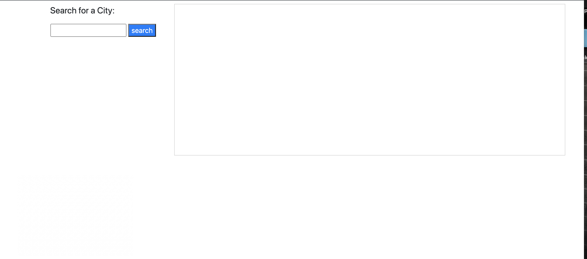

# weather-dashboard

The weather dashboard allows a user to search for a city and find a variety of weather information for said city.

Link to deployed application:
https://grahamelphick.github.io/weather-dashboard/

Screenshots of deployed application:

When a user searches for a city, they are presented with current and future conditions for that city.

For the current conditions, the user is provided with the city name, the date, an icon representation of weather conditions, the temperature, the humidity, the wind speed, and the UV index.

The UV index is colour-coded to inform the user of the severity of the UV conditions.
Green = "low"
Yellow = "moderate"
Orange = "high"
Red = "very high"
Violet = "extreme"

The future weather conditions for the city include a 5-day forecast for the date, an icon representation of weather conditions, the temperature, and the humidity.

When a city is searched, a button is generated displaying the city name. Clicking on this button will again present the current and future weather conditions for that city.

When a user opens the weather dashboard, they are presented with the last searched city forecast.